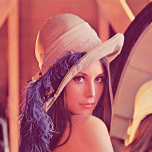
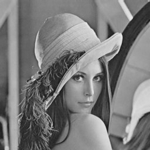
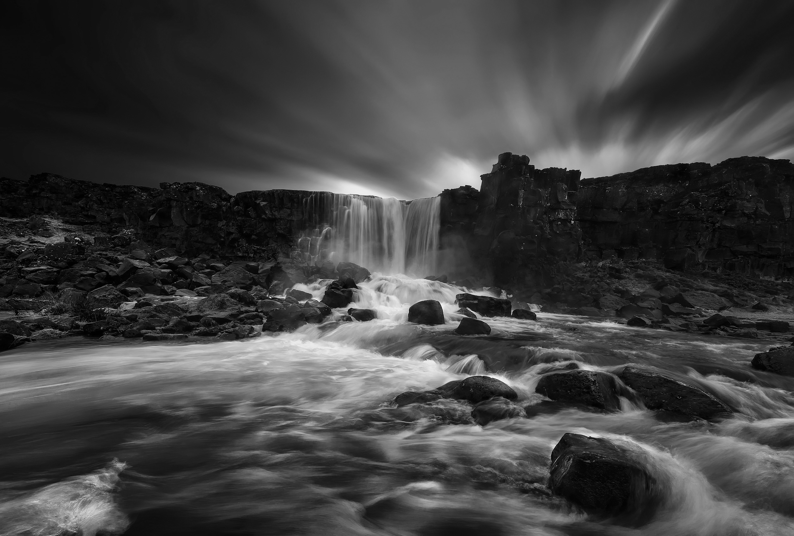
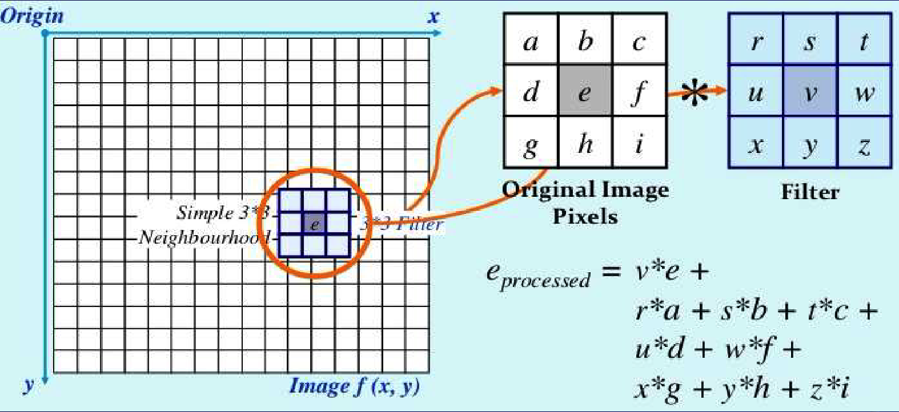
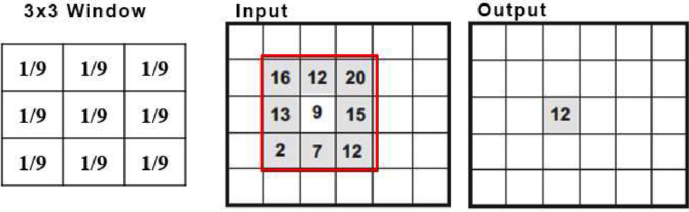
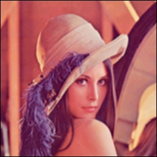

# Project 1: Embarrassingly Parallel Programming

## Prologue

As the first programming project, students are required to solve embarrassingly parallel problem with six different parallel programming languages to get an intuitive understanding and hands-on experience on how the simplest parallel programming works. A very popular and representative application of embarrassingly parallel problem is image processing since the computation of each pixel is completely or nearly independent with each other.

This programming project consists of two parts:

## Part-A: RGB to Grayscale

In this part, students are provided with ready-to-use source programs in a properly configured CMake project. Students need to download the source programs, compile them, and execute them on the cluster to get the experiment results. During the process, they need to have a brief understanding about how each parallel programming model is designed and implemented to do computation in parallel (for example, do computations on multiple data with one instruction, multiple processes with message passing in between, or multiple threads with shared memory).

### Problem Description

#### What is RGB Image?

RGB image can be viewed as three different images(a red scale image, a green scale image and a blue scale image) stacked on top of each other, and when fed into the red, green and blue inputs of a color monitor, it produces a color image on the screen.

**Reference:** https://www.geeksforgeeks.org/matlab-rgb-image-representation/

#### What is Grayscale Image?

A grayscale (or graylevel) image is simply one in which the only colors are shades of gray. The reason for differentiating such images from any other sort of color image is that less information needs to be provided for each pixel. In fact a `gray' color is one in which the red, green and blue components all have equal intensity in RGB space, and so it is only necessary to specify a single intensity value for each pixel, as opposed to the three intensities needed to specify each pixel in a full color image.

**Reference:** https://homepages.inf.ed.ac.uk/rbf/HIPR2/gryimage.htm (Glossary of University of Edinburgh)

#### RGB to Grayscale as a Point Operation

Transferring an image from RGB to grayscale belongs to point operation, which means a function is applied to every pixel in an image or in a selection. The key point is that the function operates only on the pixel’s current value, which makes it completely embarrassingly parallel.

In this project, we use NTSC formula to be the function applied to the RGB image.

```math
Gray = 0.299 * Red + 0.587 * Green + 0.114 * Blue
```

**Reference:** https://support.ptc.com/help/mathcad/r9.0/en/index.html#page/PTC_Mathcad_Help/example_grayscale_and_color_in_images.html

### Example

<div>
    
    
</div>
<p style="font-size: medium;" align="center">
    <strong>Convert Lena JPEG image (256x256) from RGB to Grayscale</strong>
</p>

<div>
    
    <br />
    
</div>
<p style="font-size: medium;" align="center">
    <strong>Convert 4K JPEG image (3840x2599) from RGB to Grayscale</strong>
</p>

## Part-B: Image Filtering (Soften with Equal Weight Filter)

In part B, students are asked to implement parallel programs by themselves do embarrassingly parallel image filtering, which is slightly harder than PartA. This time, they need to take the information of the pixel's neighbors into consideration instead of doing computation on the pixel itself. Although two pixels may share the same neighbors, the read-only property still makes the computation embarrassingly parallel.

### Problem Description

Image Filtering involves applying a function to every pixel in an image or selection but where the function utilizes not only the pixels current value but the value of neighboring pixels. Some of the filtering functions are listed below, and the famous convolutional kernel computation is also a kind of image filtering

- blur
- sharpen
- soften
- distort

Two images below demostrate in detail how the image filtering is done. Basically, we have a filter matrix of given size (3 for example), and we slide that filter matrix across the image to compute the filtered value by element-wise multipling and summation. 

<div>
  
  <p style="font-size: medium;" align="center">
    <strong>How to do image filtering with filter matrix</strong>
  </p>
</div>

<div>
  
  <p style="font-size: medium;" align="center">
    <strong>An example of image filtering of size 3</strong>
  </p>
</div>

In this project, students are required to apply the simplest size-3 low-pass filter with equal weights to smooth the input JPEG image, which is shown below. Note that your program should also work for other filter matrices of size 3 with different weights.

<table>
<tr>
    <td align="center">1 / 9</td>
    <td align="center">1 / 9</td>
    <td align="center">1 / 9</td>
</tr>
<tr>
    <td align="center">1 / 9</td>
    <td align="center">1 / 9</td>
    <td align="center">1 / 9</td>
</tr>
<tr>
    <td align="center">1 / 9</td>
    <td align="center">1 / 9</td>
    <td align="center">1 / 9</td>
</tr>
</table>

### Reminders of Implementation
1. The pixels on the boundary of the image do not have all 8 neighbor pixels. For these pixels, you can either use padding (set value as 0 for those missed neighbors) or simply ignore them, which means you can handle the (width - 2) * (height - 2) inner image only. In this way, all the pixels should have all 8 neighbors.
2. Check the correctness of your program with the Lena RGB image. The 4K image has high resolution and the effect of smooth operation is hardly to tell.

### Examples

<div style="display:flex;justify-content:space-around; align-items:center;">
  
  
</div>
<p style="font-size: medium;" align="center">
    <strong>Lena RGB Original and Smooth from left to right</strong>
</p>

### Benchmark Image

The image used for performance evaluation is a 20K JPEG image with around 250 million pixels (19200 x 12995) retrieved by doing upper sampling on the 4K image.

### Requirements

- **Six parallel programming implementations for PartB**
  - SIMD 
  - MPI 
  - Pthread
  - OpenMP 
  - CUDA 
  - OpenACC 

- **Performance of The Program**
  Try your best to do optimization on your parallel programs for higher speedup.If your programs shows similar performance to the sample solutions provided by the teaching stuff, then you can get full mark. Points will be deduted if your parallel programs perform poor while no justification can be found in the report. (Target Peformance will be released soon).
  Some hints to optimize your program are listed below:
  - Try to avoid nested for loop, which often leads to bad parallelism.
  - Change the way that image data or filter matrix are storred for more efficient memory access.
  - Try to avoid expensive arithmetic operations (for example, double-precision floating point division is very expensive, and takes a few dozens of cycles to finish).
  - Partition your data for computation in a proper way for balanced workload when doing parallelism.

### How to compile the programs?

```bash
cd /path/to/project1
mkdir build && cd build
# Change to -DCMAKE_BUILD_TYPE=Debug for debug build error message logging
# Here, use cmake on the cluster and cmake3 in your docker container
cmake ..
make -j4
```

Compilation with `cmake` may fail in docker container, if so, please compile with `gcc`, `mpic++`, `nvcc` and `pgc++` in the terminal with the correct optimization options.

## Performance Evaluation

### PartA: RGB to Grayscale

**Experiment Setup**

- On the cluster, allocated with 32 cores
- Experiment on a 20K JPEG image (19200 x 12995 = 250 million pixels)
- [sbatch file for PartA](src/scripts/sbatch_PartA.sh)
- Performance measured as execution time in milliseconds

| Number of Processes / Cores | Sequential | SIMD (AVX2) | MPI | Pthread | OpenMP | CUDA | OpenACC |
|-----------------------------|------------|-------------|-----|---------|--------|------|---------|
| 1                           | 632        | 416         | 665 | 704     | 475    | 27   | 28      |
| 2                           | N/A        | N/A         | 767 | 638     | 471    | N/A  | N/A     |
| 4                           | N/A        | N/A         | 490 | 358     | 448    | N/A  | N/A     |
| 8                           | N/A        | N/A         | 361 | 178     | 288    | N/A  | N/A     |
| 16                          | N/A        | N/A         | 288 | 116     | 158    | N/A  | N/A     |
| 32                          | N/A        | N/A         | 257 | 62      | 126    | N/A  | N/A     |


### PartB

**Experiment Setup**

- On the cluster
- JPEG image (19200 x 12995 = 250 million pixels)
- [sbatch file here](src/scripts/sbatch_PartB.sh)
- Performance measured as execution time in milliseconds

| Number of Processes / Cores | Sequential | SIMD (AVX2) | MPI  | Pthread | OpenMP | CUDA | OpenACC |
|-----------------------------|------------|-------------|------|---------|--------|------|---------|
| 1                           | 7247       | 4335        | 7324 | 8066    | 8542   | 32   | 23      |
| 2                           | N/A        | N/A         | 7134 | 7229    | 7299   | N/A  | N/A     |
| 4                           | N/A        | N/A         | 3764 | 3836    | 3886   | N/A  | N/A     |
| 8                           | N/A        | N/A         | 2093 | 1835    | 1862   | N/A  | N/A     |
| 16                          | N/A        | N/A         | 1083 | 924     | 1089   | N/A  | N/A     |
| 32                          | N/A        | N/A         | 694  | 535     | 605    | N/A  | N/A     |
